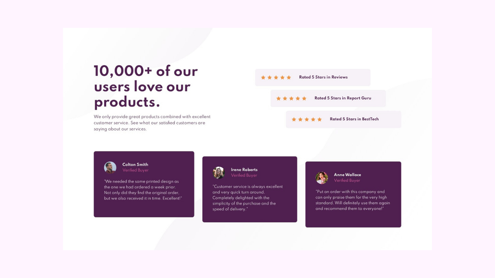
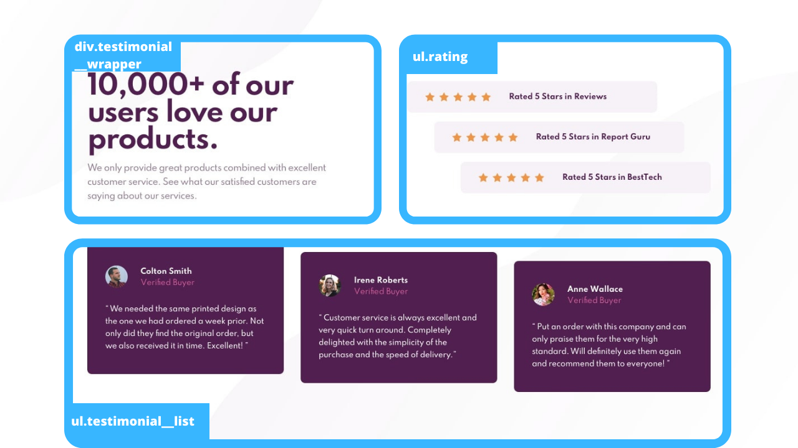
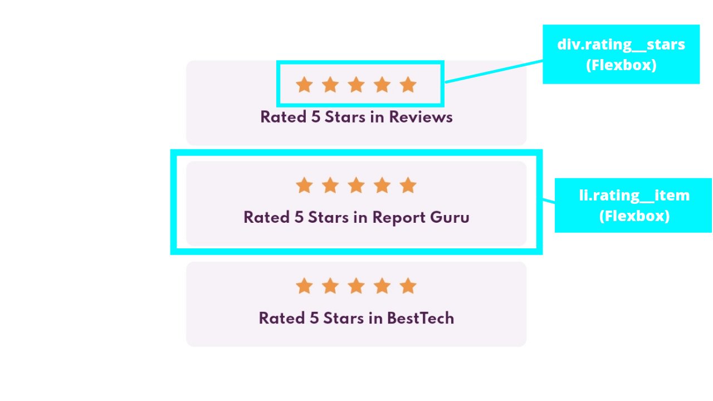
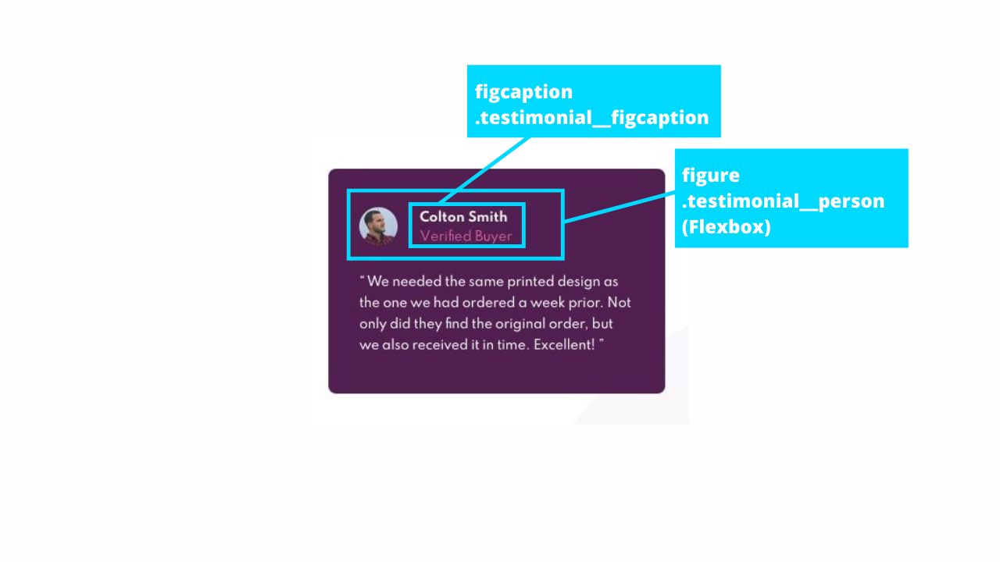
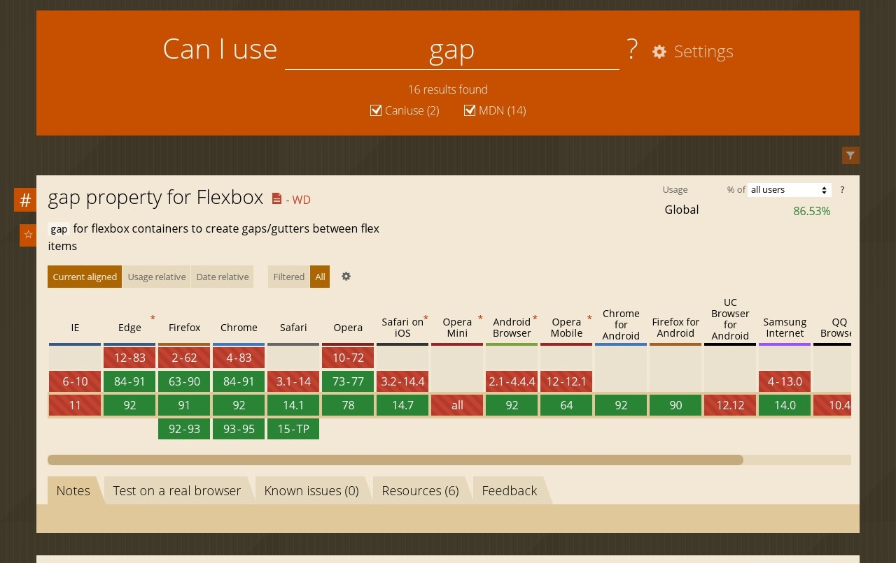
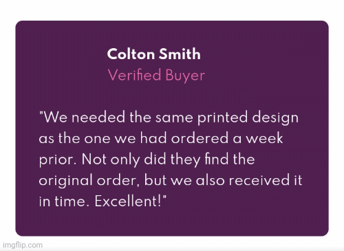

# Social Proof Section Challenge

## Disclaimer

This project is solely for learning purposes. I take no any responsibility or liability for the accuracy, completeness, or usefulness of any information provided in this project. You should not use it as a reference for creating your project.

I am currently no longer working on this project.

## Overview

### Links

- [Live Review](https://vanzasocialproof.netlify.app/)
- [Frontend Mentor Solution](https://www.frontendmentor.io/solutions/social-proof-section-hmtl5-css3-sass-1MYuG2zzt)

### Screenshots



## My Process

### Built With

- HTML Semantic Tags
- [Sass](https://sass-lang.com/)
- Flexbox
- Mobile-first workflow
- [Normalize.css](https://necolas.github.io/normalize.css/)
- [Eruda - mobile console browser](https://github.com/liriliri/eruda)

### General Structure







### What I Learned

Well I actually learn a lot about how to write a good `README.md`, than the project itself. But, I'm gonna write every technique that I did when building this project.

#### CSS Shorthand Properties

I recommend to always use shorthand property everytime you have a chance to do it. Because...

> Using a shorthand property, you can write more concise (and often more readable) style sheets, saving time and energy.

From [MDN | CSS Shorthand Property](https://developer.mozilla.org/en-US/docs/Web/CSS/Shorthand_properties)

It saves your priceless time and energy! But, it is a little bit tricky. I recommend that only use shorthand properties, like `font`, `padding`, `background`, `margin`, etc, for things that will consistent on any condition. In this case, the *repetition* and the *position* of the background will always be the same. But, the `background-image` will change on desktop screen size. So, what I did...

```css
body {
  /* The position and repetition will always be the same,
     no matter how big or small the 
     user screen size. */
  background: 
    top left no-repeat, 
    bottom right no-repeat;
  /* While the image url will be changed
     on certain size. */
  background-image: 
    url("../images/bg-pattern-top-mobile.svg"), 
    url("../images/bg-pattern-bottom-mobile.svg");
}

@media screen and (min-width: 37.5em) {
  body {
    /* Used desktop bg-pattern */
    background-image: 
      url("../images/bg-pattern-top-desktop.svg"), 
      url("../images/bg-pattern-bottom-desktop.svg");
  }
}
```

This way, you only need to write the new `background-image` inside the `@media` query.

#### Support Query

> The @supports CSS at-rule lets you specify declarations that depend on a browser's support for one or more specific CSS features. This is called a feature query. The rule may be placed at the top level of your code or nested inside any other conditional group at-rule.

From [MDN | @supports - CSS: Cascading Style Sheets](https://developer.mozilla.org/en-US/docs/Web/CSS/@supports)

It's simply, let us give fallback by specifying another CSS property that gets more support by most browsers or the opposite. For example, I want to use `gap` property on flexbox layout. But, unfortunately the [Mi Browser](https://play.google.com/store/apps/details?id=com.mi.globalbrowser) doesn't support `gap` property and `@support` query.

I had checked [Can I Use for `gap` property](https://caniuse.com/?search=gap) for the flexbox layout, it gets **86.5%**, which in my opinion it's already get supported well.



But, let say I care all the users that use Mi Browser and other browsers that don't support `gap` property.

```css
/**
* 1. If the browser doesn't support the 
*    "@support" query or the property inside the
*    support query then, it will apply 
*    this styling.
*/

.rating__stars {
  display: flex;
}
/* If the browser support the "gap" 
   property, then use it */
@supports (gap: 0.5rem) {
  .rating__stars {
    gap: 0.5rem; /* 1 */
  }
}

.rating__star:not(:first-child) {
  margin-left: 0.5rem; /* 1 */
}

/* If the browser support the gap 
   property then, I don't need 
   "margin-left" for the star that is 
   not the first child of the 
   .rating__stars. */
@supports (gap: 0.5rem) {
  .rating__star:not(:first-child) {
    margin-left: 0;
  }
}
```

#### Cumulative Layout Shift

Have you ever go to a website and then you want to click something and suddenly... the button \*keep moving\* down? It's usually because the ads or images that causing it. This is where `width` and `height` properties is coming to play.

> Always include `width` and `height` size attributes on your images and video elements... This approach ensures that the browser can allocate the correct amount of space in the document while the image is loading.

From [Web Dev | Optimize Cumulative Layout Shift](https://web.dev/optimize-cls/)

By using `width` and `height` property, it will prevent the shifting layout from happening. 👍



*It creates a **placeholder** before the image is fully loaded*

Also don't worry about the `width` and `height` property will override the external styling. They won't do that. It's also will scale automatically based on its *aspect ratio*.

### Useful Resources

- [BEM By Examples](https://sparkbox.com/foundry/bem_by_example) - This helped me understand better about BEM. If you're still get confused about BEM, then check it out!
- [Github Markdown Cheat Sheet](https://guides.github.com/pdfs/markdown-cheatsheet-online.pdf) - If I forget about markdown syntax, then this is a file that I often refer to.
- [Flexbox Malven](https://flexbox.malven.co/) - If one day, I forget about flexbox, then this is a great reminder.
- [Can I Use](https://caniuse.com/) - It helped me to know whether or not that CSS property has been widely supported.

## Acknowledgements

For this `README.md` file I got inspiration from @jubeatt\'s [README.md file on Sunnyside-agency-landing-page repo](https://github.com/jubeatt/Sunnyside-agency-landing-page#readme). It is a nice and informative `README.md`. For those of you who are doing the [Sunnyside agency landing page challenge](https://www.frontendmentor.io/challenges/sunnyside-agency-landing-page-7yVs3B6ef), I recommend to read that to get some tips on doing the challenge.

### Banner

- For the banner image, I used [Canva](https://www.canva.com/).
- The doodle image on the banner is coming from [Open Doodles website](https://opendoodles.com/).
- For the programming logos on the banner, they're coming from [Devicon](https://devicon.dev/) for the HTML and CSS logo. For the Sass I used the Sass logo from the [Sass official website](https://sass-lang.com/styleguide/brand).

## License

[MIT](./LICENSE)

## References

### Blog Posts

- [How to write an Awesome README](https://towardsdatascience.com/how-to-write-an-awesome-readme-68bf4be91f8b)
- [Medium | How to Write Beautiful and Meaningful README.md](https://blog.bitsrc.io/how-to-write-beautiful-and-meaningful-readme-md-for-your-next-project-897045e3f991)
- [BEM By Examples](https://sparkbox.com/foundry/bem_by_example)
- [Freecodecamp | How to Write a Good README File for Your GitHub Project](https://www.freecodecamp.org/news/how-to-write-a-good-readme-file/)

### GitHub Repositories

- [List of awesome README.md](https://github.com/matiassingers/awesome-readme/blob/master/readme.md)
- [Jubeatt's README.md](https://github.com/jubeatt/Sunnyside-agency-landing-page#readme)

### Others

- [choosealicense.com](https://choosealicense.com)
- [Shields.io](https://shields.io) - For all the badges.
- [Canva](https://canva.com) - For designing.
- [Sass Guidelines](https://sass-guidelin.es/)
- [CSS Validator](https://jigsaw.w3.org/css-validator/)
- [HTML Validator](https://validator.w3.org/)
- [Font Converter](https://www.fontconverter.io/en) - Convert `ttf` to `woff` and `woff2`
- [Gif Marker - imgflip](https://imgflip.com/gif-maker)
