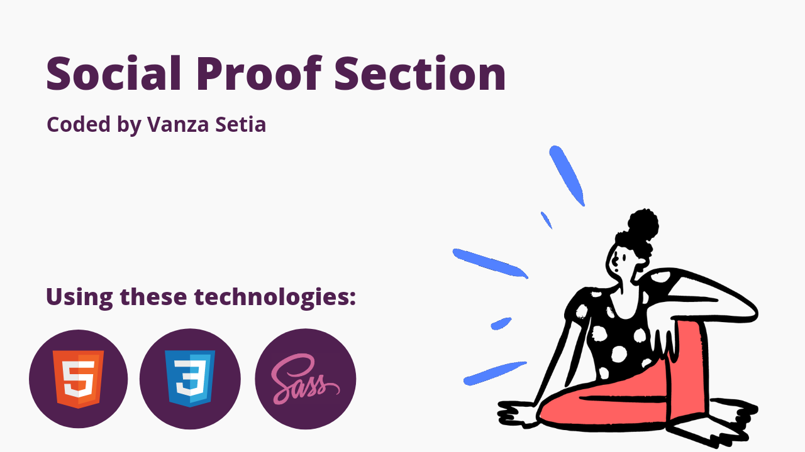

<!-- Banner -->

<!-- ENDOF Banner-->

<!-- Badges -->
<p align="left">
  
  
  <a href="https://twitter.com/vanzasetia" target="_blank"></a>
  
  
  
</p>
<!-- ENDOF Badges -->

<!-- CSS Validation Status -->
<p>
  <a href="http://jigsaw.w3.org/css-validator/check/referer">
    
    </a>
</p>
<!-- ENDOF CSS Validation Status -->

<!-- Title -->
# Social Proof Section Challenge
<!-- Title -->

<!-- Table Of Contents -->
## Table of contents
- [Overview](#overview)
  - [The challenge](#the-challenge)
  - [Links](#links)
- [My process](#my-process)
  - [Built with](#built-with)
  - [What I learned](#what-i-learned)
    - [CSS Shorthand Properties](#css-shorthand-properties)
    - [Support Query](#support-query)
    - [Cumulative Layout Shift](#cumulative-layout-shift)
  - [Useful resources](#useful-resources)
  - [Continued development](#continued-development)
- [How to contribute](#how-to-contribute)
  - [Practice](#practice)
  - [Prerequisite](#prerequisite)
  - [Setup](#setup)
- [Author](#author)
- [Acknowledgements](#acknowledgements)
  - [Thank you](#thank-you)
  - [Inspiration](#inspiration)
  - [Banner](#banner)
- [License](#license)
- [References](#references)
  - [Blog posts](#blog-posts)
  - [GitHub repositories](#github-repositories)
  - [Others](#others)
<!-- ENDOF Table Of Contents -->

<!-- Overview -->
## Overview
[(Back to top)](#table-of-contents)

### The Challenge
You should:
- Build this website and get it looking as close to the design as possible.
- Have a basic knowledge of HTML and CSS Grid or Flexbox.
- Make it accessible for everyone by using HTML semantic tags, aria properties, and etc.

Users should be able to:
- View the optimal layout for the section depending on their device's screen size

### Links
- [🌐 Live Review](https://vanzasocialproof.netlify.app/)
- [👨‍🏫 Frontend Mentor Solution](https://www.frontendmentor.io/solutions/social-proof-section-hmtl5-css3-sass-1MYuG2zzt)
<!-- ENDOF Overview -->

<!-- My Process -->
## My Process
[(Back to top)](#table-of-contents)

### Built With
- HTML Semantic Tags
- [Sass](https://sass-lang.com/)
- Flexbox
- Mobile-first workflow
- [Normalize.css](https://necolas.github.io/normalize.css/)
- [Eruda - mobile console browser](https://github.com/liriliri/eruda)
- And many [NPM packages](#prerequisite) 😂

### General Structure


### What I Learned
Well I actually learn a lot about how to write a good `README.md`, than the project itself. But, I'm gonna write every technique that I did when building this project.

#### CSS Shorthand Properties
I recommend to always use shorthand property everytime you have a chance to do it. Because...

> Using a shorthand property, you can write more concise (and often more readable) style sheets, saving time and energy.

From [MDN | CSS Shorthand Property](https://developer.mozilla.org/en-US/docs/Web/CSS/Shorthand_properties)

It saves your priceless time and energy! But, it is a little bit tricky. I recommend that only use shorthand properties, like `font`, `padding`, `background`, `margin`, etc, for things that will consistent on any condition. In this case, the *repetition*, *position*, and the *size* of the background will always be the same. But, the `background-image` will change on desktop screen size. So, what I did...
```css
body {
  /* The position, repetition, and 
     the size will always be the same,
     no matter how big or small the 
     user screen size. */
  background: 
    top left/100% no-repeat, 
    bottom right/100% no-repeat;
  /* While the image url will be changed
     on certain size. */
  background-image: 
    url("../images/bg-pattern-top-mobile.svg"), 
    url("../images/bg-pattern-bottom-mobile.svg");
}
```
This way, you only need to write the new `background-image` inside the `@media` query.

#### Support Query

> The @supports CSS at-rule lets you specify declarations that depend on a browser's support for one or more specific CSS features. This is called a feature query. The rule may be placed at the top level of your code or nested inside any other conditional group at-rule.

From [MDN | @supports - CSS: Cascading Style Sheets](https://developer.mozilla.org/en-US/docs/Web/CSS/@supports)

It's simply, let us give fallback by specifying another CSS property that gets more support by most browsers or the opposite. For example, I want to use `gap` property on flexbox layout. But, unfortunately the [Mi Browser](https://play.google.com/store/apps/details?id=com.mi.globalbrowser) doesn't support `gap` property and `@support` query.

I had checked [Can I Use for `gap` property](https://caniuse.com/?search=gap) for the flexbox layout, it gets **86.5%**, which in my opinion it's already get supported well.


But, let say I care all the users that use Mi Browser and other browsers that don't support `gap` property.

```css
/**
* 1. If the browser doesn't support the 
*    "@support" query or the property inside the
*    support query then, it will apply 
*    this styling.
*/

.rating__stars {
  display: flex;
}
/* If the browser support the "gap" 
   property, then use it */
@supports (gap: 0.5rem) {
  .rating__stars {
    gap: 0.5rem; /* 1 */
  }
}

.rating__star:not(:first-child) {
  margin-left: 0.5rem; /* 1 */
}

/* If the browser support the gap 
   property then, I don't need 
   "margin-left" for the star that is 
   not the first child of the 
   .rating__stars. */
@supports (gap: 0.5rem) {
  .rating__star:not(:first-child) {
    margin-left: 0;
  }
}
```

#### Cumulative Layout Shift
Have you ever go to a website and then you want to click something and suddenly... the button \*keep moving\* down? It's usually because the ads or images that causing it. This is where `width` and `height` properties is coming to play.

> Always include `width` and `height` size attributes on your images and video elements... This approach ensures that the browser can allocate the correct amount of space in the document while the image is loading.

From [Web Dev | Optimize Cumulative Layout Shift](https://web.dev/optimize-cls/)

By using `width` and `height` property, it will prevent the shifting layout from happening 👍.


*It creates a **placeholder** before the image is fully loaded*

Also don't worry about the `width` and `height` property will override the external styling. They won't do that. It's also will scale automatically based on its *aspect ratio*.

### Useful Resources
- [BEM By Examples](https://sparkbox.com/foundry/bem_by_example) - This helped me understand better about BEM. If you're still get confused about BEM, then check it out!
- [Github Markdown Cheat Sheet](https://guides.github.com/pdfs/markdown-cheatsheet-online.pdf) - If I forget about markdown syntax, then this is a file that I often refer to.
- [Flexbox Malven](https://flexbox.malven.co/) - If one day, I forget about flexbox, then this is a great reminder.
- [Can I Use](https://caniuse.com/) - It helped me to know whether or not that CSS property has been widely supported.

### Continued Development
<!-- ENDOF My Process -->

<!-- How To Contribute -->
## How To Contribute
[(Back to top)](#table-of-contents)

### Practice
If this the first time, you are starting to contribute to an open source, it might be confusing to follow along. I recommend to check this article about [make your first open-source contribution by Marco Denic](https://community.codenewbie.org/denicmarko/make-your-first-open-source-contribution-19k2). After that, you can come back and follow along.

### Prerequisite
- If you find bug, tpo, issue, grammar error, or anything that can be improved, then continue. If not, well just [skip to the next section](#author).
- You need to have [Node.js](https://nodejs.org/en/) installed on your machine. To check that you have Node.js, try to run this command on your terminal:
```
node --version
```
- You need all these packages **installed globally** to run all the scripts on `package.json`.
  - [Browsersync](https://browsersync.io/) for the development server.
  - [Sass](https://www.npmjs.com/package/sass) to compile Sass code into CSS.
  - [npm-run-all](https://www.npmjs.com/package/npm-run-all) to run the `devserver` and the `watch:sass` script simultaneously. Also, for the `build` script.
  - [Postcss](https://www.npmjs.com/package/postcss) to run autoprefixer.
  - [Autoprefixer](https://www.npmjs.com/package/autoprefixer) to add vendor prefixes if needed.
  - [Prettier](https://www.npmjs.com/package/prettier) to format the HTML code.
  - [csscomb](https://www.npmjs.com/package/csscomb) to format and sort the properties order the Sass and CSS files.
  - [markserv](https://www.npmjs.com/package/markserv) live server for the markdown file. (Optional).

### Setup
- First, fork this repo.
- Clone this repo to your local machine with HTTPS or SSH.
- Navigate to this project folder using your favorite terminal.
- Add the project repository as the "upstream" remote.
  - In your project repository, click the download button and then copy the HTTPS URL.
  - Then type this and paste the URL.
```
git remote add upstream <url>
```
  - Use git `remote -v` to check that you now have two remotes.
- To make sure that you have the lastest version of the project repository, run this command.
```
git pull 
```
- Create a new branch, by execute this command. You can change the branch name based on what are you going to do, for this example I call it, `fixingbugs`.
```
git checkout -b fixingbugs
```
- Now, you can start editing the files. Run `npm start` for the development environment. `localhost:8080` for web development and `localhost:8642` for `README.md`.
- After you have finished editing, simply run `npm run build`.
- Add all files to staging area.
```
git add .
```
- Then, you can commit your changes.
```
git commit -m "Fixed bugs"
```
- Push your changes.
```
git push -u origin fixingbugs
```
- After that you can see the `Compare and Pull Request` button and follow the instructions.
- That's it! Thanks for your contribution! 🤗
<!-- ENDOF How To Contribute -->

<!-- Author -->
## Author
[(Back to top)](#table-of-contents)

- Frontend Mentor - [@vanzasetia](https://www.frontendmentor.io/profile/vanzasetia)
- Twitter - [@vanzasetia](https://www.twitter.com/vanzasetia)
<!-- ENDOF Author -->

<!-- Acknowledgements -->
## Acknowledgements
[(Back to top)](#table-of-contents)

### Thank You!
First of all, thank you for everyone that has read this till this point. 👍 You are amazing! You don't jump to this section directly, do you? 🙄

### Inspiration
For this `README.md` file I got inspiration from @jubeatt\'s [README.md file on Sunnyside-agency-landing-page repo](https://github.com/jubeatt/Sunnyside-agency-landing-page#readme). It is a nice and informative `README.md`. For those of you who are doing the [Sunnyside agency landing page challenge](https://www.frontendmentor.io/challenges/sunnyside-agency-landing-page-7yVs3B6ef), I recommend to read that to get some tips on doing the challenge.

### Banner
- For the banner image, I used [Canva](https://www.canva.com/). It's free and can be used on Android. 
- The doodle image is coming from [Open Doodles website](https://opendoodles.com/). It's free!
- For the programming logos, they're coming from [Devicon](https://devicon.dev/) for the HTML and CSS logo. For the Sass I used the Sass logo from the [Sass official website](https://sass-lang.com/styleguide/brand).
<!-- END OF Acknowledgements -->

<!-- LICENSE -->
## License
[(Back to top)](#table-of-contents)

>You can check out [the full license](https://github.com/vanzasetia/social-proof-section/blob/master/LICENSE)

This project is licensed under the terms of the MIT license.

For those of you who are wondering, why do you need to license this? 
- Well, first it's free 😁.
- Second I check this [Choose license website](https://choosealicense.com/) to help me choose a license.
- The last reason, if I don't want to choose a license, then [here's what gonna happen](https://choosealicense.com/no-permission/).
<!-- ENDOF LICENSE -->

<!-- References -->
## References
[(Back to top)](#table-of-contents)

### Blog Posts
- [Medium | How to Write Beautiful and Meaningful README.md](https://blog.bitsrc.io/how-to-write-beautiful-and-meaningful-readme-md-for-your-next-project-897045e3f991)
- [BEM By Examples](https://sparkbox.com/foundry/bem_by_example)
- [Freecodecamp | How to Write a Good README File for Your GitHub Project](https://www.freecodecamp.org/news/how-to-write-a-good-readme-file/)

### GitHub Repositories
- [List of awesome README.md](https://github.com/matiassingers/awesome-readme/blob/master/readme.md)
- [Jubeatt's README.md](https://github.com/jubeatt/Sunnyside-agency-landing-page#readme)

### Others
- [Shields.io](https://shields.io) - For all the badges.
- [Canva](https://canva.com) - For designing.
- [Sass Guidelines](https://sass-guidelin.es/)
- [CSS Validator](https://jigsaw.w3.org/css-validator/)
- [HTML Validator](https://validator.w3.org/)
- [Font Converter](https://www.fontconverter.io/en) - Convert `ttf` to `woff` and `woff2`
- [Gif Marker - imgflip](https://imgflip.com/gif-maker)

<!-- ENDOF References -->